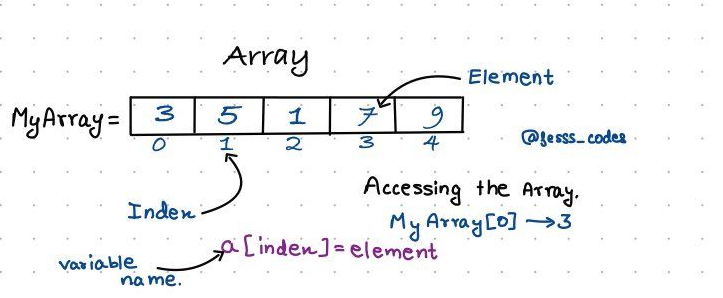

# Array
An array is a collection of items of same data type stored at contiguous memory locations. This makes it easier to calculate the position of each element by simply adding an offset to a base value, i.e., the memory location of the first element of the array (generally denoted by the name of the array).

Array is similiar to defining any other variables. 
*Two things need to be done while initialize the array* 
- Datatype of the array
- Size of the array
> Array size cannot be change dynamically 

**Advantages of the array**
 - Arrays allow random access of elements. This makes accessing elements by position faster.
 - Arrays have better cache locality that can make a pretty big difference in performance.

 `
 char arr1[] = {'g', 'e', 'e', 'k', 's'};
 int arr2[] = {10, 20, 30, 40, 50};
 For example arr1[0] gives us 'g'
 arr2[3] gives us 40.
 `
 
