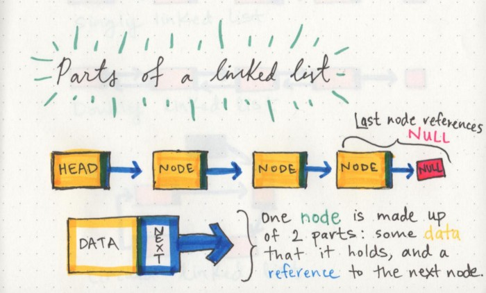

# Linked-List
 A linked list is a linear data structure that contains a sequence of nodes, in which each node contains data and a pointer to another node

**Parts of Linked list**

 
> A node only knows about what data it contains, and who its neighbor is

**Advantages**
- Dyanmic memory allogations
- Able to shirnk and grow and any instant

 

**Disadvantages**
- Accessing particular value in linked list is more costly in terms of time and action than performing the same operations in array
- A linked list may not even be more efficient from a memory standpoint because you also have to use memory to store the next value of every node.

## Problems:

| Problems    | Soultion  |      
| :------------- |:-------------:| 
| Add 1 to a number represented as linked list |   [Here](https://www.geeksforgeeks.org/add-1-number-represented-linked-list/)            |
| Add two numbers represented by linked lists |   [Here](https://www.geeksforgeeks.org/add-two-numbers-represented-by-linked-lists/)            |
| Check if Linked List is Palindrome |   [Here](https://www.geeksforgeeks.org/function-to-check-if-a-singly-linked-list-is-palindrome/)            |
| Clone a linked list with next and random pointer  |   [Here](https://www.geeksforgeeks.org/a-linked-list-with-next-and-arbit-pointer/)            |
| Count Pairs whose sum is equal to X  |   [Here](https://www.geeksforgeeks.org/count-pairs-two-linked-lists-whose-sum-equal-given-value/)            |
| Delete keys in a Linked list |   [Here](https://www.geeksforgeeks.org/delete-occurrences-given-key-linked-list/)            |
| Delete Middle of Linked List  |   [Here](https://www.geeksforgeeks.org/delete-middle-of-linked-list/)            |
| Delete node in Doubly Linked List |   [Here](https://www.geeksforgeeks.org/delete-a-node-in-a-doubly-linked-list/) |
| Delete nodes having greater value on righ |   [Here](https://www.geeksforgeeks.org/delete-nodes-which-have-a-greater-value-on-right-side/) |
| Delete without head pointer  |   [Here](https://www.geeksforgeeks.org/delete-a-node-from-linked-list-without-head-pointer/) |
| Detect Loop in linked list |   [Here](https://www.geeksforgeeks.org/detect-loop-in-a-linked-list/) |
| Finding middle element in a linked list  |   [Here](https://www.geeksforgeeks.org/write-a-c-function-to-print-the-middle-of-the-linked-list/) |
| Find length of loop in linked list |   [Here](https://www.geeksforgeeks.org/find-length-of-loop-in-linked-list/) |
| Flattening a Linked List|   [Here](https://www.geeksforgeeks.org/flattening-a-linked-list/) |
| Given a linked list of 0s, 1s and 2s, sort it |   [Here](https://www.geeksforgeeks.org/sort-a-linked-list-of-0s-1s-or-2s/) |
| Given a linked list, reverse alternate nodes and append at the end |   [Here](https://www.geeksforgeeks.org/given-linked-list-reverse-alternate-nodes-append-end/) |
| Insert in a Sorted List  |   [Here](https://www.geeksforgeeks.org/given-a-linked-list-which-is-sorted-how-will-you-insert-in-sorted-way/) |
| Intersection of Two Linked Lists  |   [Here](https://leetcode.com/problems/intersection-of-two-linked-lists/) |
| Intersection of two sorted Linked lists  |   [Here](https://www.geeksforgeeks.org/intersection-of-two-sorted-linked-lists/) |
| Intersection Point in Y Shapped Linked Lists |   [Here](https://www.geeksforgeeks.org/write-a-function-to-get-the-intersection-point-of-two-linked-lists/) |
| Linked List in Zig-Zag fashion  |   [Here](https://www.geeksforgeeks.org/linked-list-in-zig-zag-fashion/) |
| Linked List that is Sorted Alternatingly |   [Here](https://www.geeksforgeeks.org/how-to-sort-a-linked-list-that-is-sorted-alternating-ascending-and-descending-orders/) |
| Merge K sorted linked lists |   [Here](https://www.geeksforgeeks.org/merge-k-sorted-linked-lists/) |
| Nth node from end of linked list  |   [Here](https://www.geeksforgeeks.org/nth-node-from-the-end-of-a-linked-list/) |
| Pairwise swap elements of a linked list  |   [Here](https://www.geeksforgeeks.org/pairwise-swap-elements-of-a-given-linked-list/) |
| Rearrange a linked list  |   [Here](https://www.geeksforgeeks.org/rearrange-a-linked-list-such-that-all-even-and-odd-positioned-nodes-are-together/) |
| Remove duplicates from an unsorted linked list |   [Here](https://www.geeksforgeeks.org/remove-duplicates-from-an-unsorted-linked-list/) |
| Remove loop in Linked List  |   [Here](https://www.geeksforgeeks.org/detect-and-remove-loop-in-a-linked-list/) |
| Reverse a Linked List in groups of given size |   [Here](https://www.geeksforgeeks.org/reverse-a-list-in-groups-of-given-size/) |
| Rotate a Linked List  |   [Here](https://www.geeksforgeeks.org/rotate-a-linked-list/) |
| Sorted insert for circular linked list |   [Here](https://www.geeksforgeeks.org/sorted-insert-for-circular-linked-list/) |
| Subtract Two Numbers represented as Linked Lists |   [Here](https://www.geeksforgeeks.org/subtract-two-numbers-represented-as-linked-lists/) |
| XOR Linked List |   [Here](https://www.geeksforgeeks.org/xor-linked-list-a-memory-efficient-doubly-linked-list-set-1/) |
| Union of Two Linked Lists |   [Here](https://www.geeksforgeeks.org/union-and-intersection-of-two-linked-lists/) |