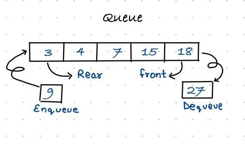

# Queue
A queue is an ordered list in which insertions are done at one end (rear) and
deletions are done at other end (front). The first element to be inserted is the first one to be deleted. Hence, it is called First in First out (FIFO) or Last in Last out (LILO) list.

 

**Examples :** The concept of a queue can be explained by observing a line at a reservation counter. When we
enter the line we stand at the end of the line and the person who is at the front of the line is the one who will be served next. He will exit the queue and be served.
> DeQueueing an empty queue is called underflow and EnQueuing an element in a full queue is called overflow

## Queue ADT

### Main Queue Operation
- EnQueue() : Insert the element at the end of the queue
- DeQueue() : Removes and return the element at the end of the queue

### Auxiliary Queue Operation
- Front(): Returns the element from the front of the queue without removing it
- QueueSize(): Returns the number of the stored in the  queue
- IsEmptyQueue() : Indicates the no elements are stored in the queue or not 

## Application

### Direct Application:
- Operating systems schedule jobs (with equal priority) in the order of arrival
- Simulation of real-world queues such as lines at a ticket counter
- Asynchronous data transfer
- 
### Indirect Application:
- Auxiliary data structure for algorithms

## Problems:

| Problems    | Soultion  |      
| :------------- |:-------------:| 
|  | [Here]() | 
|  | [Here]() | 
|  | [Here]() | 
|  | [Here]() | 
|  | [Here]() | 
|  | [Here]() | 
|  | [Here]() | 
|  | [Here]() | 
|  | [Here]() | 
|  | [Here]() | 