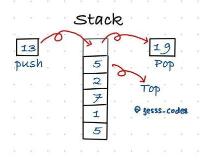

# Stack

A stack is an ordered list in which insertion and deletion are done at one end, called
top. The last element inserted is the first one to be deleted. Hence, it is called the Last in First out(LIFO) or First in Last out (FILO) list. 

**Example**: A pile of plates in a cafeteria is a good example of a
stack. The plates are added to the stack as they are cleaned and they are placed on the top. When a
plate, is required it is taken from the top of the stack. The first plate placed on the stack is the last one to be used.

 

## Stack ADT
The following operations make a stack an ADT. For simplicity, assume the data is an integer type.
### Main stack operations
- Push(): Inserts data onto stack.
- Pop(): Removes and returns the last inserted element from the stack.

### Auxiliary stack operations

- Top(): Returns the last inserted element without removing it.
- Size():Returns the number of elements stored in the stack.
- IsEmptyStack():Indicates whether any elements are stored in the stack or not.
- IsFullStack(): Indicates whether the stack is full or not.

## Applications:
### Direct applications
- Balancing of symbols
- Infix-to-postfix conversion
- Evaluation of postfix expression
- Implementing function calls (including recursion)
- Finding of spans (finding spans in stock markets, refer to Problems section)
- Page-visited history in a Web browser [Back Buttons]
- Undo sequence in a text editor
- Matching Tags in HTML and XML
### Indirect applications
- Auxiliary data structure for other algorithms (Example: Tree traversal algorithms)

## Problems:

| Problems    | Soultion  |      
| :------------- |:-------------:| 
| Evaluation of Postfix Expression  | [Here]() |
| Get minimum element from stack  | [Here]() |
| Implement stack using array  | [Here]() |
| Implement Stack using Linked List  | [Here]() |
| Implement two stacks in an array  | [Here]() |
| Maximum of minimum for every window size  | [Here]() |
| Next larger element  | [Here]() |
| Parenthesis Checker  | [Here]() |
| Sort a stack  | [Here]() |
| Special Stack  | [Here]() |
| Stack using two queues  | [Here]() |
| Stock span problem  | [Here]() |