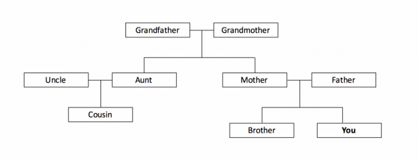
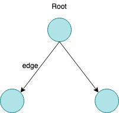
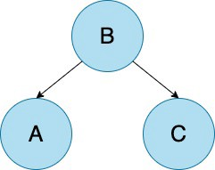

# Tree 
A Tree is a non-linear data structure that organizes data in a hierarchical way. You can liken them to a family tree with many generations; grandparents, parents, children, etc. Family trees are organized hierarchically

 
The tree data structure is a collection of nodes. These nodes are connected to each other by edges. Each node contains a value (data) and may or may not have a child node. In every (non-empty) tree, the first node of the tree is called the root.

 
If this root node is connected to one or more nodes, it is the parent node and the connected nodes are its children. Nodes with no children are called leaves or external nodes. Nodes which are not leaves are called internal nodes. Internal nodes have at least one child. Nodes with the same parent are said to be siblings.

> On any subtree, the left nodes are less than the root node, which is less than all of the right nodes.

**Binary tree traversal** 
 
- In-Order Traversal: Visit the left node first, then the root, then right. A → B → C.
- Pre-Order Traversal: Visit the root first, then visit its left node, then right. B → A → C.
- Post-Order Traversal: Visit the left node first, then the right node, then the root. A →C →B.

## Problems:

| Problems    | Soultion  |      
| :------------- |:-------------:| 
| Ancestors in Binary Tree  | [Here](https://www.geeksforgeeks.org/print-ancestors-of-a-given-node-in-binary-tree/) |
| AVL Tree Deletion | [Here](https://www.geeksforgeeks.org/avl-tree-set-2-deletion/) |
| Binary Tree to CDLL | [Here](https://www.geeksforgeeks.org/convert-a-binary-tree-to-a-circular-doubly-link-list/) |
|Binary Tree to DLL  | [Here](https://www.geeksforgeeks.org/convert-given-binary-tree-doubly-linked-list-set-3/) |
| Bottom View of Binary Tree  | [Here](https://www.geeksforgeeks.org/bottom-view-binary-tree/) |
| Boundary Traversal of binary tree | [Here](https://www.geeksforgeeks.org/boundary-traversal-of-binary-tree/) |
| Burning Tree  | [Here](https://www.geeksforgeeks.org/burn-the-binary-tree-starting-from-the-target-node/) |
| Check for Balanced Tree | [Here](https://www.geeksforgeeks.org/how-to-determine-if-a-binary-tree-is-balanced/) |
| Check if subtree | [Here](https://www.geeksforgeeks.org/check-if-a-binary-tree-is-subtree-of-another-binary-tree/) |
| Check if Tree is Isomorphic  | [Here](https://www.geeksforgeeks.org/tree-isomorphism-problem/) |
| Check if two Nodes are Cousins  | [Here](https://www.geeksforgeeks.org/check-two-nodes-cousins-binary-tree/) |
| Children Sum Parent  | [Here](https://www.geeksforgeeks.org/check-for-children-sum-property-in-a-binary-tree/) |
| Clone a Binary Tree | [Here](https://www.geeksforgeeks.org/clone-binary-tree-random-pointers/) |
| Connect Nodes at Same Level  | [Here](https://www.geeksforgeeks.org/connect-nodes-at-same-level/) |
| Construct Binary Tree from Parent Array | [Here](https://www.geeksforgeeks.org/construct-a-binary-tree-from-parent-array-representation/) |
| Construct Tree from Inorder & Preorder | [Here](https://www.geeksforgeeks.org/construct-tree-from-given-inorder-and-preorder-traversal/) |
| Construct Tree from Preorder Traversal  | [Here](https://www.geeksforgeeks.org/construct-bst-from-given-preorder-traversa/) |
| Determine if Two Trees are Identical  | [Here](https://www.geeksforgeeks.org/write-c-code-to-determine-if-two-trees-are-identical/) |
| Diagonal Sum In Binary Tree | [Here](https://www.geeksforgeeks.org/diagonal-sum-binary-tree/) |
| Diameter of Binary Tree | [Here](https://www.geeksforgeeks.org/diameter-of-a-binary-tree/) |
| Height of Spiral Tree  | [Here](https://www.geeksforgeeks.org/find-height-of-a-special-binary-tree-whose-leaf-nodes-are-connected/) |
| Tree traversal | [Here](https://www.geeksforgeeks.org/tree-traversals-inorder-preorder-and-postorder/) |
| Nodes at k distance from root | [Here](https://www.geeksforgeeks.org/print-nodes-at-k-distance-from-root/) |
| Leftmost and rightmost nodes of binary tree | [Here](https://www.geeksforgeeks.org/print-leftmost-and-rightmost-nodes-of-a-binary-tree/) |
| Lowest Common Ancestor in a Binary Tree | [Here](https://www.geeksforgeeks.org/lowest-common-ancestor-binary-tree-set-1/) |
| Maximum difference between node and its ancestor | [Here](https://www.geeksforgeeks.org/maximum-difference-between-node-and-its-ancestor-in-binary-tree/) |
| Maximum Width of Tree  | [Here](https://www.geeksforgeeks.org/maximum-width-of-a-binary-tree/) |
| Sum of Left Leaf Nodes  | [Here](https://www.geeksforgeeks.org/find-sum-left-leaves-given-binary-tree/) |
| ZigZag Tree Traversal | [Here](https://www.geeksforgeeks.org/zigzag-tree-traversal/) |
| Print Nodes having K leaves | [Here](https://www.geeksforgeeks.org/print-nodes-binary-tree-k-leaves/) |